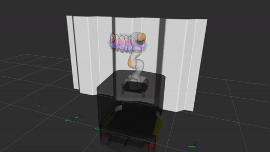

# SSK: Robotic Pen-Art System for Large, Nonplanar Canvas

*Tested on **Ubuntu 18.04** with **ROS Melodic**.*



This repository provides ROS-based simulation and visualization on a **large-scale robotic drawing system** using our customed, integrated robots, ridgeback mobile platform with KUKA LBR iiwa 7 R800 manipulator.

It partially contains the implementation of our paper "[SSK: Robotic Pen-Art System for Large, Nonplanar Canvas](http://graphics.ewha.ac.kr/ssk/)", published in IEEE T-RO. 

## Dependencies

- [ROS Melodic](http://wiki.ros.org/melodic/Installation/Ubuntu) with Python3

### ⚠️ ROS-Python3 Installation

This might break your ROS workspace if you have your own ROS workspace running with Python2.

1. Install ROS-Python3 related packages

```shell
sudo apt install python3-pip python3-all-dev python3-rospkg
```

2. Re-install ROS. Change *Melodic* with your version

```shell
sudo apt install ros-melodic-desktop-full --fix-missing 
```

3. Set your ROS version to Python3
```shell
echo "export ROS_PYTHON_VERSION=3" >> ~/.bashrc
```

## Build and Compile

1. Clone this repository:
```sh
mkdir ros_ws && cd ros_ws && mkdir src
catkin_init_workspace
cd src
git clone https://github.com/daeunSong/large_scale_drawing.git
```

2. Clone **iiwa** and **ridgeback** related repositories:
```sh
git clone -b glab/drawing https://github.com/daeunSong/iiwa_stack.git
git clone -b glab/integration https://github.com/daeunSong/ridgeback.git
git clone https://github.com/ridgeback/ridgeback_desktop.git
git clone https://github.com/ridgeback/ridgeback_simulator.git
git clone https://github.com/daeunSong/ridgeback_iiwa_integration.git
```

3. Install the dependencies:
```shell
sudo apt-get install python3-catkin-tools
pip3 install numpy matplotlib
```
```sh
cd ..
rosdep install --from-paths src --ignore-src -r -y
```

4. Build the workspace:
```sh
catkin build
```

5. Set your workspace:
```shell
echo "source ~/ros_ws/devel/setup.bash" >> ~/.bashrc
```

6. Add a parameter for robot description:
```shell
echo "export RIDGEBACK_URDF_EXTRAS=$(catkin_find ridgeback_iiwa_description urdf/ridgeback_iiwa_robot.urdf.xacro --first-only)" >> ~/.bashrc
```

7. source the bash file:

```sh
source ~/.bashrc
```

## Demo

1. Run gazebo and bring up the robot model
```sh
roslaunch ridgeback_iiwa_gazebo ridgeback_iiwa_gazebo.launch world_name:=empty
```
If you change the `pyshics/real time update rate` value to 0, the simulation will run as fast as it can.


2. Run moveIt! and rviz visualization related nodes
```sh
roslaunch large_scale_drawing prep_drawing_moveit.launch
```

3. Run robot drawing manager
```sh
roslaunch large_scale_drawing drawing_manager.launch
```

4. After few seconds run the Ridgeback node
```sh
rosrun large_scale_drawing ridgeback.py
```

To change the drawing input, change the name of the configuration file in [here](https://github.com/daeunSong/large_scale_drawing/blob/31b85f34acbd624ab041da2da8223dcf6439c6a2/iiwa/launch/prep_drawing_moveit.launch#L8). Please refer to the details of the **config file** in [here](https://github.com/daeunSong/large_scale_drawing/tree/debug/data/config) and the **input drawing** file in [here](https://github.com/daeunSong/large_scale_drawing/tree/debug/data/input).

## Citation
IEEE T-RO 2023, "[SSK: Robotic Pen-Art System for Large, Nonplanar Canvas](http://graphics.ewha.ac.kr/ssk/)"
```
@ARTICLE{10114055,
    author={Song, Daeun and Park, Jiyoon and Kim, Young J.},
    journal={IEEE Transactions on Robotics}, 
    title={SSK: Robotic Pen-Art System for Large, Nonplanar Canvas}, 
    year={2023},
    volume={39},
    number={4},
    pages={3106-3119},
    doi={10.1109/TRO.2023.3268585}
}
```
IEEE ICRA 2019, "[Distortion-free Robotic Surface-drawing using Conformal Mapping](https://ieeexplore.ieee.org/abstract/document/8794034)"
```
@inproceedings{song2019distortion,
    title={Distortion-free Robotic Surface-drawing using Conformal Mapping},
    author={Song, Daeun and Kim, Young J},
    booktitle={2019 International Conference on Robotics and Automation (ICRA)},
    pages={627--633},
    year={2019},
    organization={IEEE}
}
```
IEEE ICRA 2018, "[Artistic Pen Drawing on an Arbitrary Surface using an Impedance-controlled Robot](https://ieeexplore.ieee.org/abstract/document/8461084)":
```
@inproceedings{song2018artistic,
    title={Artistic pen drawing on an arbitrary surface using an impedance-controlled robot},
    author={Song, Daeun and Lee, Taekhee and Kim, Young J},
    booktitle={2018 IEEE International Conference on Robotics and Automation (ICRA)},
    pages={4085--4090},
    year={2018},
    organization={IEEE}
}
```
