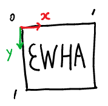
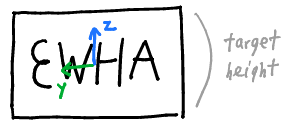

# Drawing input file

The drawing input files come from [here](https://github.com/daeunsong/LindeBuzoGrayStippling/tree/tsp). Make sure you install all the [dependencies](https://github.com/daeunsong/LindeBuzoGrayStippling/tree/tsp) and follow the [build instructions](https://github.com/daeunSong/LindeBuzoGrayStippling/blob/tsp/README.md#building).

## Format

 

```shell
width height
x1 y1
x2 y2
... 
End
```
The first line of the drawing input file contains the **width** and **height** of the original input image. 

Starting from the second line, *(x, y)* coordinates are listed. *End* indicates end of the stroke. This coordinates are normalized in [0, 1]. Therefore, you must multiply the target width and height of the drawing to get the proper sized darwing as you expected.   



For convenience, we set the TARGET SIZE as a target height. So following should be done:
```sh
double ratio = width / height;
y = (-stod(tempSplit[0])+0.5) * ratio * TARGET_SIZE;
z = (-stod(tempSplit[1])+0.5) * TARGET_SIZE;
```

This is done automatically for you. If you wish to change the target size, just change the value in [here](https://github.com/daeunSong/large_scale_drawing/blob/31b85f34acbd624ab041da2da8223dcf6439c6a2/iiwa/include/drawing_input_range.h#L40).

