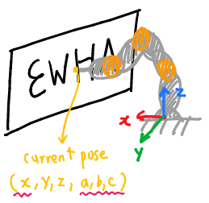

# Drawing input file

The drawing input files come from [here](https://github.com/daeunsong/LindeBuzoGrayStippling/tree/tsp). Make sure you install all the [dependencies](https://github.com/daeunsong/LindeBuzoGrayStippling/tree/tsp) and follow the [build instructions](https://github.com/daeunSong/LindeBuzoGrayStippling/blob/tsp/README.md#building).

## Format

 

```shell
width height
x1 y1
x2 y2
... 
```
The first line of the drawing input file contains the **width** and **height** of the original input image. 

Starting from the second line, *(x, y)* coordinates are listed. This coordinates are normalized in [0, 1]. Therefore, you must multiply the target width and height of the drawing to get the proper sized darwing as you expected.   


For convenience, we set the TARGET SIZE as a target height. So following should be done:
```sh
double ratio = width / height;
y = (-stod(tempSplit[0])+0.5) * ratio * TARGET_SIZE;
z = (-stod(tempSplit[1])+0.5) * TARGET_SIZE;
```

This is done automatically for you already in [here](https://github.com/daeunSong/large_scale_drawing/blob/6989aee903cb2b19dad5aec67036164c4c4fce18/iiwa/src/drawing_input.cpp#L63). If you wish to change the target size, just change the value in [here](https://github.com/daeunSong/large_scale_drawing/blob/6989aee903cb2b19dad5aec67036164c4c4fce18/iiwa/include/drawing_input.h#L30).


### Flat Surface



Now this is transformed into a 3D space. *x* is determined as a detected wall pose, and *z* needs to be translated up as much as the initial iiwa pose. This is also done automatically for you in [here](https://github.com/daeunSong/large_scale_drawing/blob/71dd99277699f41a5f2f2a09a5e0f8159a323a73/iiwa/src/drawing_iiwa.cpp#L278-L281), by giving `drawing_point` value, which is the detected wall pose in [here](https://github.com/daeunSong/large_scale_drawing/blob/71dd99277699f41a5f2f2a09a5e0f8159a323a73/iiwa/src/drawing_iiwa.cpp#L264).


### Curved Surface

surface normal -> euler angle

